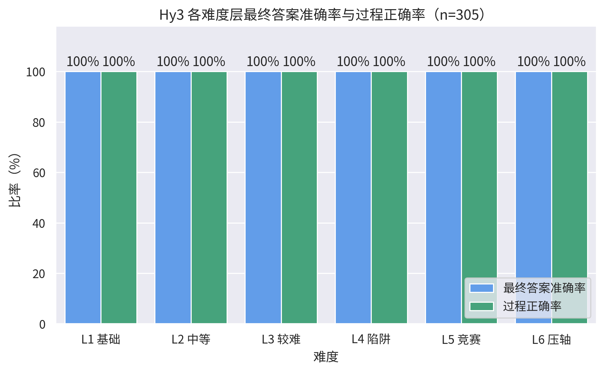
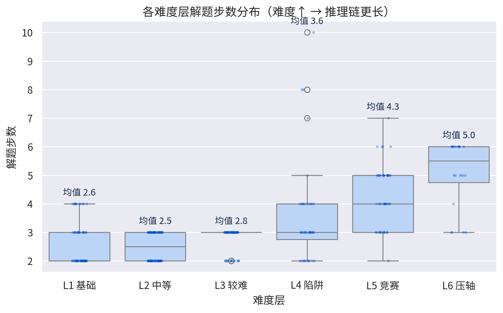
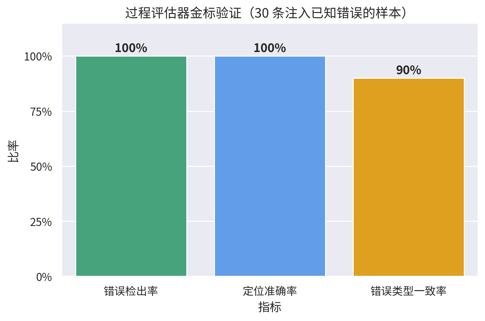
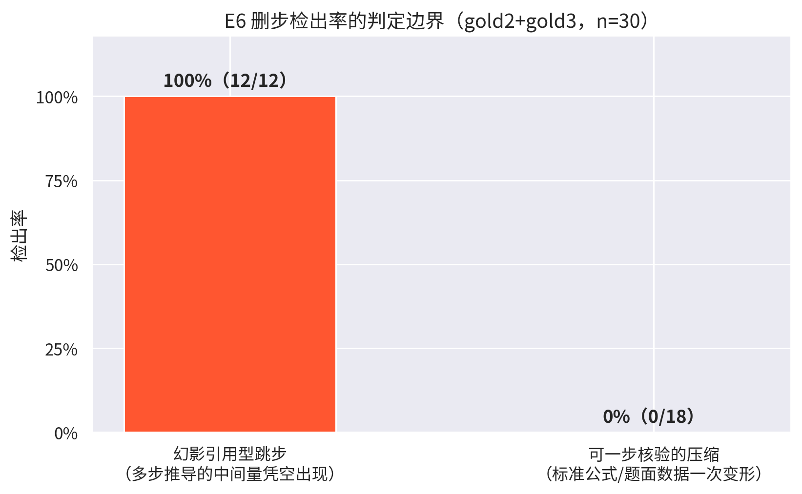
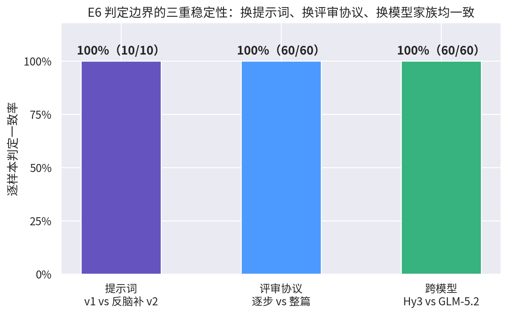

# 分析报告：基于 Hy3 的数学解题过程评估与错误定位

> 2026 腾讯犀牛鸟开源人才培养计划「Shape With AI」实战任务二 · 个人作品（非腾讯官方发布）
> 作者：谢伯锴（华南理工大学）

## 1. 场景选择理由

选择**数学解题**作为可验证场景，原因有三：

1. 每道题存在明确标准答案，可自动校验，满足"可验证场景"的根本前提；
2. 数学解答天然分步，推理链条可显式表达，过程评估有抓手；
3. 难度跨度大（四则运算 → 竞赛技巧 → 压轴题），便于做难度分层与临界点分析。

**应用形态**：一个"解题 + 过程质检"系统。目标用户是需要批量批改/质检 AI 解题过程的人
（教师、题库建设者、模型评测者）；待解决的问题是"只看最终答案会漏掉过程错误"，
包括最隐蔽的一类——**答案对了但推理过程不成立**。

## 2. 系统架构

模型能力全部通过 **WorkBuddy 客户端内的混元 Hy3** 完成（导师指定方式），
确定性环节由本地 Python 脚本完成，两者通过 JSON 文件解耦：

```
WorkBuddy(Hy3) 解题 ──→ solutions.json ──┐
                                          ├─→ WorkBuddy(Hy3) 逐步评审 ──→ reviews.json
题目 + 标准答案（评审时才给出）─────────────┘
                                          │
                          本地 Python：答案校验（精确/数值/符号三级）
                          + 指标统计 + 图表生成 → eval.jsonl / summary
```

设计要点：

- **解题批次不含标准答案**，防止模型直接抄答案，保证评测有效性；
- **答案校验在本地代码完成**（精确匹配 → 内置安全求值），确定、可复现、零模型调用；
- 评审端在 WorkBuddy 内会调用沙盒 Python 对 CRT、递推、对数方程等做独立验算，
  属任务允许的"沙盒执行验证"；
- 稳健性环节引入**第二模型家族（GLM-5.2）交叉复核**，缓解同模型自评偏好（见 §9）。

## 3. 评测题集

305 题全部由 `scripts/build_dataset.py` 程序化生成（随机种子 20260822 可复现），
**标准答案由程序直接计算，不经过任何大模型**，从源头保证正确；生成后经独立代码
路径重算抽检 17 题，无不一致。详见 `data/problems/README.md`。

| 难度层 | 题数 | 定位 | 典型题型 |
|---|---|---|---|
| L1 基础 | 60 | 一两步可得答案 | 四则混合、一元一次方程、折扣、平均数 |
| L2 中等 | 80 | 需正确选用公式、多步推导 | 等差/等比数列、二次函数最值、古典概率 |
| L3 较难 | 60 | 需识别结构、用对技巧 | 平方和、幂的个位周期、阶乘末尾零、韦达定理 |
| L4 陷阱 | 40 | 经典认知陷阱 | 火车过桥、锯木头、爬楼梯、时钟夹角 |
| L5 竞赛 | 45 | 多步技巧型 | 错位排列、数位计数、裂项相消、贝叶斯、幂取模 |
| L6 压轴 | 20 | 长链条综合题 | 错位相减求和、会面几何概型、绝对值方程根数、斐波那契取模、带约束隔板 |

L1~L3 按"知识点深度 × 推理步数 × 技巧性"分层；L4/L5 为寻找模型能力临界点而设；
L6 为正式竞赛/高考压轴风格的长链条综合题，推理链显著更长（见 §6）。

另有**外部经典题集 20 题**（`data/real/real.jsonl`，`scripts/build_real_set.py`）：
选自公开流传的高考/竞赛风格经典题型，与本流水线生成的主题集相互独立，
每题答案由代码独立验证（枚举/幂运算/符号化简），用于检验外部效度（见 §9）。

## 4. 过程评估方法设计依据

评审采用**逐步行审 + 首错即停**：

1. 第 i 步只在「题目条件 + 已确认正确的前序步骤」基础上评审，
   把每次判断的上下文缩到最小，判定标准可操作、结论可复现；
2. 发现首个不成立步骤即停止——后续错误多由首错传导，计入会污染错误类型分布；
3. 全部步骤成立但最终答案错误 → 错误定位记为 `final`；
4. 与整篇一次性评审相比，逐步评审才能稳定给出"首个出错步"这一定位结果。

注：§9 的对照实验表明，对本题集样本，整篇评审与逐步评审的判定逐样本一致——
逐步协议的价值在于**输出结构化的逐步判定与可复现的评审纪律**，而非改变判定结果。

## 5. 错误分类体系

10 类（E1 题意误读 / E2 概念理解错误 / E3 公式定理误用 / E4 计算错误 /
E5 条件遗漏 / E6 跳步推导 / E7 幻觉编造 / E8 单位量纲错误 / E9 格式不符 /
E10 其他），每类给出可操作判定标准，见 `src/process_eval/taxonomy.py`。

## 6. 完整评测结果

在 305 题上（评审与解题均由 Hy3 完成）：

| 指标 | 结果 |
|---|---|
| 最终答案准确率 | **100%**（305/305） |
| 过程正确率 | **100%** |
| 答案对但过程不成立 | 0 条 |
| 误报率（人工抽检前） | **0%**（0/305 被误判过程问题） |



**难度分层结论**：L1~L6 各层答案准确率与过程正确率均为 100%，
**在本题集难度覆盖范围内（含压轴长链条题）未观察到表现明显下降的区间**。
难度提升的体现是推理链变长：L1 平均 2.6 步 → L5 平均 4.3 步，
L6 进一步显著拉长（下图），即模型用更长的过程换取了同等的正确率。



## 7. 过程评估器的有效性验证

由于 Hy3 在自然解题中未犯错，错误样本通过**金标注入**构造，共三轮 60 条：

**第一轮：值篡改与依据编造（30 条）**。在正确解答的已知步骤注入已知类型错误
（篡改计算结果 E4×11、编造不适用依据 E7×18、公式名误用 E3×1），金标对评审保密。

| 验证项 | 结果 |
|---|---|
| 错误检出率 | **30/30 = 100%** |
| 定位准确率（精确命中出错步） | **30/30 = 100%** |
| 错误类型一致率 | 27/30 = 90% |



误报率验证：正常集 305 条答案均正确，评审判出过程问题 0 条，误报率 0%。
另从"过程正确"样本中分层抽样 30 条逐条人工复核：**30/30 复核成立，未发现漏判**
（抽检清单与逐条复核记录见 `docs/audit_sample.xlsx`）。

**第二、三轮：E6 跳步注入（gold2×10 + gold3×20，删步构造）**。用脚本从正确解答中
**整步删除**一个中间步骤（`scripts/inject_errors.py --only-skip`），得到"最终答案
仍正确、但过程缺环"的样本——教科书级的"答案对过程错"。合并 30 条结果：
**检出 12/30，检出的样本首错定位 11/12 精确命中**（唯一分歧见 §8 口径说明）。

## 8. 评估器迭代：跳步检出的判定边界

第一轮 E6 检出率只有 50%，最初假设根因是评审器"脑补"被删步骤。为此设计了
**加严版评审提示词 v2**（`prompts/reviewer_task_v2.md`），核心条款"严禁脑补：
当前步必须由前序**显式写出**的内容严格推出"。对照结果：**v2 与 v1 判定逐样本
完全一致（10/10）**，且对正常批次重审仍零误报——漏判不是提示词松动，而是
模型稳定的判定边界。

样本量扩大到 30 条后逐条分析删步内容，边界可以用一句话精确刻画：

> **"幻影引用"必抓，"可一步核验的压缩"容忍。**

| 删步类型 | 判定规则 | 示例 | 检出率 |
|---|---|---|---|
| **幻影引用型** | 需多步推导才能得到的中间量/结论凭空出现 | 直接引用从未求解的方程根（gold2-002）；引用未计算的递推项 a₅=445、D₇=1854、a₆=727、D₄=9、D₅=44；CRT 通式未合并导致参数矛盾（gold2-005/007、gold3-007）；全概率值 23/44 凭空出现（gold3-011） | **12/12 = 100%** |
| **可一步核验的压缩** | 被删内容只剩一次标准变形：题面数据一次求值、标准公式一次套用，或剩余文本仍含来源线索（表达式内可见/枚举覆盖/显式验证） | 移项合并进下一步（gold2-001/010）；⌊158/15⌋=10 并入"52+31−10"（gold2-004）；裂项相消的展开省略但相消断言仍在（gold3-006/010/013）；等比和 1022 一步代入（gold3-017） | 0/18 |



两点口径说明：

- **定位分歧 1 条（gold3-015）**：金标按"删步位置"记第 3 步，评审判第 4 步——
  即首个因缺环而真正失真的步骤，且理由准确描述了缺失的错位相减变形。
  这属于标注口径差异（删步位置 vs 首个受影响步），评审判定本身更合理；
- **类型分歧 2 条（gold2-005/007）**：评审判 E4"参数取值与公式不一致"而非 E6，
  单看判定成立，与第一轮 3 条类型分歧同属相邻类别边界问题。

这一边界与人工评分惯例一致：批改允许把一次初等变形压缩进下一步，
但不能接受凭空引用从未推导的中间结果。

## 9. 稳健性与外部效度实验

**三重稳定性**：E6 判定边界在三个维度上逐样本不变（下图）——

1. **换提示词**：v1 vs 反脑补 v2，10/10 一致；
2. **换评审协议**：整篇一次性评审 vs 逐步行审（`prompts/whole_review_task.md`），
   60 条金标逐样本判定完全一致——对本题集，评审协议粒度不改变判定结果；
3. **换模型家族**：GLM-5.2 交叉复核全部 60 条金标，检出与定位和 Hy3
   **逐样本 100% 一致**，包括同样的 18 条容忍与 12 条检出。
   跳步容忍边界因此不是 Hy3 的个别偏好，而是跨模型稳定的判定惯例；
   同时也独立验证了 Hy3 评审结果，缓解同模型自评偏好风险。



**外部效度**：外部经典题集 20 题（高考风格 12 + 竞赛风格 8，与主题集独立来源），
Hy3 解题 **20/20 答案精确匹配标准答案，评审判过程问题 0 条**。题集分布之外的
真实经典题上表现与主题集一致，外部效度成立。

## 10. 典型案例分析

**案例 1：陷阱识别（t4-007，锯木头）**——模型第 1 步即指出"段数比锯的次数多 1"，
显式避开经典陷阱；火车过桥题正确加上车长并做 1000/3600 单位换算。

**案例 2：错误分类边界（金标分歧 3 条）**——3 条类型不一致均发生在相邻类别边界：
- 注入把 `12!` 改为 `9!`（金标 E4 计算错误），评审判 E3"组合数公式本身写错"；
- 注入把题目给定 `105` 改为 `104`（金标 E4），评审判 E1"所用数值与题面不符"；
- 注入把"韦达定理"改称"判别式定理"（金标 E3），评审判 E2"定理概念混淆"。

三条评审判定单独看都成立，说明**分类体系在"公式写错 vs 计算错"
"条件数值篡改 vs 题意误读"等边界上需要更细的优先级约定**——这是评估方法
本身被验证"逼"出来的真实改进点。

**案例 3：幻影引用的检出与定位（gold2-008）**——斐波那契型递推题删除
"a₅=445"一步后，评审明确指出"step5 直接计算 a₆=3×445+1，但 a₅=445 从未在
前序步骤中计算"，首错定位精确命中缺环位置。GLM-5.2 复核给出逐字一致的判定。

**案例 4：可核验压缩的容忍（gold3-018，斐波那契取模）**——删除"Pisano 周期
=28"的结论句后，剩余步骤仍显式列出 r₁..r₃₀ 且 r₂₉=r₁=1、r₃₀=r₂=1（周期证据
在文本中完整可见），评审判定过程成立。该容忍与"结论可一步核验"的边界规则一致。

## 11. 模型能力边界与失败模式归纳

- 本题集内（至压轴长链条层）与外部经典题集（20 题）Hy3 均未出现自然失败；
  其过程风格是每步附依据，遇到陷阱会显式说明避坑理由；
- 未观察到"答案对但过程不成立"的自然样本；该类型的检测能力由金标注入实验
  间接验证：值篡改/依据编造（E3/E4/E7）100% 检出并定位，
  幻影引用型跳步（E6）12/12 检出、11/12 定位精确；
- 评审器的已知盲区是**可一步核验的压缩**：单步标准变形被并入下一步时不判
  跳步（v1/v2、整篇/逐步、Hy3/GLM 下均一致）。若应用方需要"步步显式"的
  严格标准，应将此边界写进评审约定并接受相应的格式类误报；
- **解题能力临界点未触达**：需要更高难度（竞赛正式难度、证明题）才能定位；
  这也是后续工作的方向。

## 12. 局限与后续工作

1. 评审主链路与被评对象同为 Hy3，存在"自评偏好"风险；已用 GLM-5.2 对全部
   60 条金标做交叉复核（逐样本 100% 一致）予以缓解，后续可在主评测集上引入
   第二模型复核；
2. 主题集为程序生成，题型边界清晰；已混入 20 道外部经典题（全部答对），
   后续应继续扩大真题比例并纳入证明题检验外部效度；
3. 金标注入的错误类型已覆盖 E3/E4/E6/E7，E5（条件遗漏）的注入需要更精细的
   语义改写，留待后续；E6 的"可核验压缩"子类是否应判错，本质上是评分标准
   问题而非模型问题，需在应用侧先明确约定；
4. 难度需继续上探（证明题、多问压轴题）以找到真正的能力临界点。
